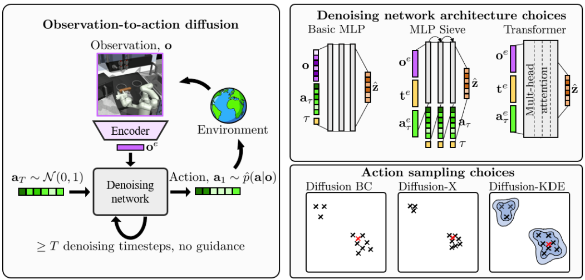

# Imitating human behaviour with diffusion models

Code from ICLR 2023 paper 'Imitating human behaviour with diffusion models' - https://arxiv.org/abs/2301.10677



Note, this code currently only replicates the claw environment experiments of the paper.

## Setup

- Install Python (ran on Python 3.9) and/or create a fresh environment
- Install requirements `pip install -r requirements.txt`
- For nice labels when plotting, set `IS_USE_LATEX=True`, and ensure you have a valid tex/latex installation. On Ubuntu, you can install all the requirements with `sudo apt install texlive texlive-latex-extra texlive-latex-recommended dvipng cm-super msttcorefonts`

## Running

### Mini script

As a lightweight entry-point to the code, we...

### Claw experiments

To recreate the claw machine figures in the paper, run `./run.sh` or alternatively run each step separately:

```
python make_dataset.py
python train.py
python plot.py
```

This creates a `figures` directory containing the main claw machine result figures shown in the paper. This cycles through all methods, and uses the transformer denoising network, resulting in a run time >24 hours.

## Trademarks

This project may contain trademarks or logos for projects, products, or services. Authorized use of Microsoft 
trademarks or logos is subject to and must follow 
[Microsoft's Trademark & Brand Guidelines](https://www.microsoft.com/en-us/legal/intellectualproperty/trademarks/usage/general).
Use of Microsoft trademarks or logos in modified versions of this project must not cause confusion or imply Microsoft sponsorship.
Any use of third-party trademarks or logos are subject to those third-party's policies.

## License
Code is licensed under MIT, data and all other content is licensed under Microsoft Research License Agreement (MSR-LA). See LICENSE folder.